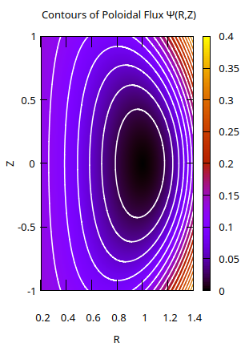

# LSC_internship
Internship at the department of Scientific Computing Cambridge simulating matter under extreme conditions. 
## Compressible Euler Equations
Finite volume schemes modelling compressible fluids in 1 and 2 dimensions include:
- First Order schemes: FORCE, Lax-Freidrichs
- Second Order schemes (with limiting): SLIC, FLIC
- Godunov methods: Exact Riemann solver, HLL, HLLC
## Magnetohydrodynamics (MHD)
Finite difference and finite volume schemes modelling plasma in 1 and 2 dimensions:
- Slope limiting scheme in 1D and 2D (SLIC)
- HLLC to approximate exact solution with 3 waves
- MUSCL-hancock in 1D and 2D with mixed GLM divergence cleaning
  

  
  

<em>Figures 1 & 2: Using MUSCL-Hancock to model Density for Orazang-Tang vortex and Magnetic Field ratio for Kelvin-Helmhotz instability</em>

## Linear Solov'Ev equation solver
Solving the sparse linear equation to solve the Solov'Ev equation modelling a nuclear fusion reactor. The linear system was solved with the C++ Eigen library, as well as analytically.

  

  
  

<em>Figures 3 & 4: Solov'Ev solution with a sparse linear solver and Solov'Ev exact solution</em>

